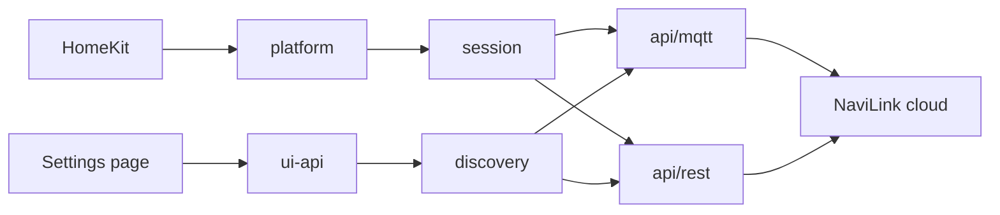

# Development

HomeKit talks to the platform. The platform owns accessory identity and starts one session for the whole account. The session signs in, holds the MQTT connection and fans observations out. Accessories render the last observation as HAP.



`src/api/` is the wire. `src/devices/` is HomeKit. `src/platform.ts` is the join. `src/session.ts` owns the plugin's entire relationship with the cloud. `src/diagnostics/` is the opt-in health heartbeat. Protocol facts live in [docs/PROTOCOL.md](docs/PROTOCOL.md), not here.

**There is one session, not one per device.** That is not a simplification: signing in twice would mean two AWS credential sets and two clients competing for the same topics. Every accessory shares it.

`dist/` is committed so a git install works. CI fails if it drifts from `src/`. Run `npm run build` and commit `dist/` with every source change. There is no `prepare` script: it would dirty the tree on every `npm install`. `prepublishOnly` still rebuilds.

## Invariants

Break these and you break someone's rooms, lock someone's account, or guess at a gas appliance.

- **Identity is `{MAC}:{channel}:{kind}`, never the address or the name.** An accessory that is removed and re-added is a *different* accessory to HomeKit, and takes its room, scenes and automations with it. Adopt a cached accessory that matches identity; do not replace it. `options.accessoryPrefix` changes the HomeKit display name only; it must not appear in the identity key.
- **A rejected credential is never retried.** `AuthenticationError` with `credentialsRejected` stops the session for good. Everything else is transient and backs off. Getting this wrong locks a user out of their own account, and the API makes it easy to get wrong: **a wrong password comes back as HTTP 200** with the error in the body. Decide on whether a token arrived, never on the status code. A rejected password does not trip the REST circuit breaker.
- **REST outages fail fast.** After five connection or protocol failures in a minute the breaker opens (`Circuit breaker CLOSED -> OPEN` at warn). Later sign-in attempts are not sent until the cooldown; a successful probe logs `HALF_OPEN` then `CLOSED` at info. MQTT stays on the session reconnect loop, not this breaker. Firmware reads (`device/info`) are optional and must not trip it: the session swallows those errors after MQTT is already live.
- **A planned close is not an outage.** Credential refresh closes the MQTT socket on purpose (`ConnectionError.expected`). Do not log `reconnect in Ns` or `Publish-subscribe (mqtt) recovered` for that path. A real drop logs the close once, then the backoff.
- **Nothing ever logs the password.** Not its length, not a prefix, not "you typed a trailing space" with the value quoted. `src/utils/redact.ts` redacts by *shape*, not by field name, so an unfamiliar response that carries an unexpected token is still covered. Adding a log line near a credential means re-reading that file first.
- **Unknown is No Response**, not zero. Until a status frame arrives, and again when the reading goes stale, characteristics report `SERVICE_COMMUNICATION_FAILURE`. `requireObservedState` in `BaseAccessory` is the only way a subclass gets state, so the decision is made once. Zero is a real temperature and several fields use it to mean "no probe fitted"; publishing it would put a permanent hard freeze in somebody's Home app.
- **Bad config disables the platform. It does not unregister anything.** Rooms and automations survive a typo. One bad `devices[]` entry is skipped; only a wholly unusable config is fatal.
- **Read-only mode and the power-off guard live in `platform.control()`.** An accessory expresses an intent; whether it happens is decided in one place. Setpoint coalescing is thermostat-only and lives on `ThermostatAccessory`.
- **Hardware wins the spec.** Record the measurement in PROTOCOL.md and pin a fixture. Never commit a raw capture. [scripts/README.md](scripts/README.md) is the pseudonymise path, and `tests/unit/fixtures.test.ts` allowlists every identifier in the tree.

A capability ships if HomeKit can express it as a tile, a scene, an automation or a spoken command. A weekly schedule cannot, so it stays in the NaviLink app.

## Commands

Node 22, 24 or 26, matching `engines`. CI runs 22 / 24 / 26 and a runtime `npm audit`. `@types/node` tracks the top of that range rather than its floor, so the Node 22 job is what catches an API the oldest supported runtime does not have. Dependabot is told not to raise it on its own, because the range and the types are meant to move together.

```bash
npm install
npm run build                          # commit dist/ with the source
npm run lint                           # warnings are failures
npx tsc --noEmit -p tsconfig.test.json # src + tests
npm test                               # jest with coverage (NODE_ENV=test)
```

The suite never touches the network. `tests/setup.js` fails the run outright if `NAVILINK_EMAIL` or `NAVILINK_PASSWORD` is set. Without that, a half-finished test that reaches for `process.env` would send a developer's own credentials to Navien from an `npm test`.

Before a release, against a real account (read-only):

```bash
npm run build
node scripts/smoke.js
node scripts/pseudonymise.js --in tests/fixtures --check
```

Tests inject fakes. `tests/helpers/hap.ts` is the HAP stand-in and `tests/helpers/socket.ts` is the MQTT transport stand-in, with its own clock so keepalives and timeouts are exercised without real sleeps. Coverage includes `homebridge-ui/` and is gated at 80%.

## The MQTT client is ours

`src/api/mqtt-codec.ts` is a hand-rolled MQTT 3.1.1 encoder and decoder. That is a deliberate decision, not an oversight.

`mqtt.js` rebuilds the WebSocket path when it opens a connection and drops the signed query string that AWS IoT requires. The upgrade is then rejected, and the failure looks exactly like a bad password. Working around it from outside the library was not possible; the codec is a small in-repo MQTT 3.1.1 client, fully tested, and removes a large dependency tree from something that runs unattended in people's homes.

If you are tempted to replace it with a library, read `docs/PROTOCOL.md` first.

## Adding a capability

1. **Establish the behaviour.** Read PROTOCOL.md for what is already known.
2. Decode it in `src/api/channel.ts`, and extend `ChannelObservation`. A field the appliance may not report is optional, and absent must not become zero.
3. Add the command to `src/api/protocol.ts`, with a named builder.
4. Add a `BaseAccessory` subclass under `src/devices/`. If it is a thermostat, extend `ThermostatAccessory`. That class already handles coalescing, clamping, optimistic state and the scale conversion.
5. Extend `config.schema.json`, `NaviLinkDeviceConfig`, and `validateConfig` / `resolveAccessories`. Accessory display names go through `resolveAccessories` so `options.accessoryPrefix` applies once. Constrain the schema to what the plugin will accept. `required` must be an array of property names on the object (draft-07); a boolean on a field breaks the settings UI.
6. Wire `createHandler` in `platform.ts`, and add the intent to `ControlIntent` and `control()`. Extend the identity key only if the accessory needs more than `kind`.
7. If the appliance can lack the hardware, report a capability from `channelinfo` and have the settings page offer the accessory only where it exists. An accessory that is permanently No Response reads as a broken plugin.
8. Tests for the decoder, the command frame, the accessory and the config path. A new response shape needs a recorded fixture, pseudonymised.
9. Update PROTOCOL.md and [docs/FEATURES.md](docs/FEATURES.md).
10. `npm run build` and commit `dist/`.
